---
category:
  - OpenApi
tag:
  - OpenApi

permalink: /open-api/coin-candle.html
---

# 1.coin-candle 市场模块 使用说明

仓库 Github 地址: <https://github.com/otter-trade/coin-candle>

要解决的问题：

1. 国内获取数据需要`科学上网`
2. 交易所请求规范和行为不统一，解析方式也不统一
3. 回测时对 K 线的消耗比较大，但是频繁去交易所获取效率太慢
4. 需要用到 K 线模块的服务太多了

> 其实最早团队内小伙伴写了一个版本，但我觉得效率不太够，于是自己一个周末肝了出来。

## 安装方式

```bash
go get github.com/otter-trade/coin-candle

```

## 代码示例

```go title="main.go"
<!-- @include: @src/open-api/coin-candle/coin-candle.go -->
```

然后 执行 `go mod tidy` 和 `go  run  main.go` 查看打印结果

## 程序架构设计图



## 程序设计思路

因为是 根据 K 线的特点，基于本地文件专门设计的读写和寻址方式 ，无需 redis，无需数据库，所有即用即走，所以效率非常高，也非常轻量化，需要经常用都的数据就进行内存缓存。

一开始是打算设计成独立服务去单独部署的，但是后来发现纯粹是多此一举，所以就设计成了 SDK 的方式。

因为提供给用户使用的是 open-api ， 只需要用 https 包一层即可。

---
