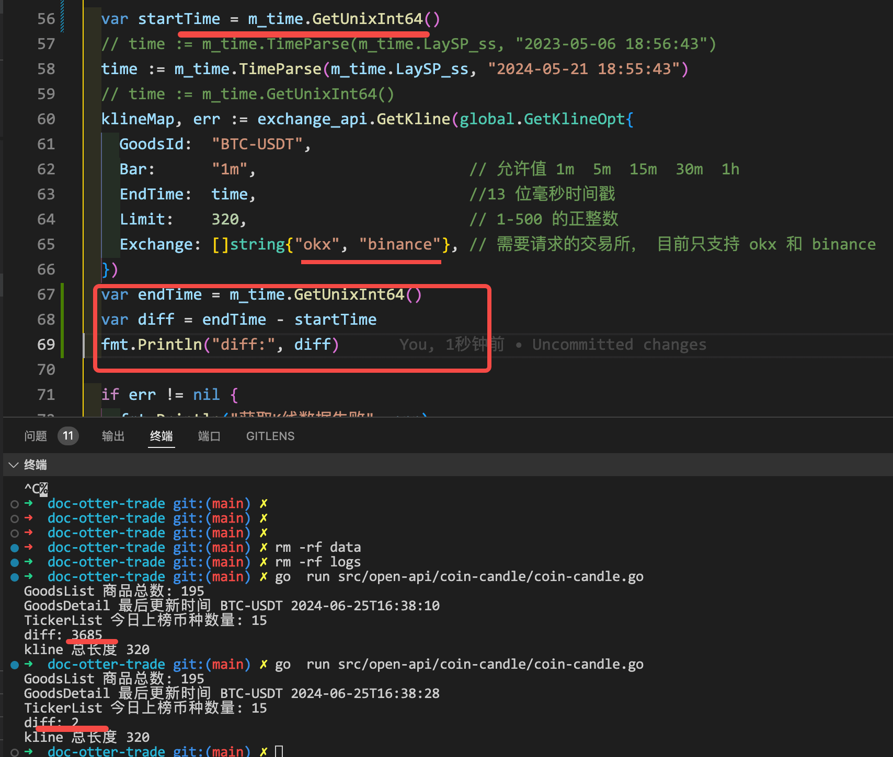

---
category:
  - OpenApi
tag:
  - OpenApi

permalink: /open-api/coin-candle.html
---

# 1.coin-candle 市场模块 使用说明

仓库 Github 地址: <https://github.com/otter-trade/coin-candle>

要解决的问题：

1. 国内获取数据需要`科学上网`
2. 交易所请求规范和行为不统一，解析方式也不统一，请求参数也比较繁琐
3. 回测时对 K 线的消耗比较大，但是频繁去交易所获取效率太慢
4. 需要用到 K 线模块的服务太多了

> 其实最早团队内小伙伴写了一个版本的市场服务，但我觉得并不满意，于是花了一个周末的时间重新肝了一个版本。

## 安装方式

```bash
go get github.com/otter-trade/coin-candle
```

## 代码示例

```go title="main.go"
<!-- @include: @src/open-api/coin-candle/coin-candle.go -->
```

安装依赖，创建文件，然后 执行 `go mod tidy` 和 `go  run  main.go` 查看打印结果

## 数据结构示意

**商品信息数据结构**

> 这里综合了 [币安](https://www.binance.com)、[欧意](https://www.okx.com)，两个交易所的公共货币，也就是说该列表的任意货币都可以在 量大交易所随时进行交易，当 `State` 不为 `live` 时，说明该币种在其中一个交易所的状态出现了问题。

更新频率可以在程序初始化时自定。

```go
type GoodsType struct {
	GoodsId       string            `json:"GoodsId"`       // OtterTrade 的交易品ID 以 OKX 为准 如 BTC-USDT
	State         string            `json:"State"`         // 交易品现货状态，默认；live OKX 现货，币安 现货 ，OKX 合约 有一家状态不对 则为 warning
	UpdateUnix    int64             `json:"UpdateUnix"`    // 更新时间戳
	UpdateStr     string            `json:"UpdateStr"`     // 更新时间
	QuoteCcy      string            `json:"QuoteCcy"`      // 计价货币 如 USDT
	BaseCcy       string            `json:"BaseCcy"`       // 基础货币 如 BTC
	Okx_SPOT_Info OkxInstType       `json:"Okx_SPOT_Info"` // 欧意交易所 现货 的完整产品信息
	Okx_SWAP_Info OkxInstType       `json:"Okx_SWAP_Info"` // 欧意交易所 合约 的完整产品信息
	BinanceInfo   BinanceSymbolType `json:"BinanceInfo"`   // 币安交易所的完整产品信息
}

```

```go
type OkxInstType struct {
	BaseCcy      string `json:"baseCcy"`      // 交易货币币种，如 BTC-USDT 中的 BTC ，仅适用于币币/币币杠杆
	CtMult       string `json:"ctMult"`       // 合约乘数
	CtType       string `json:"ctType"`       // 合约类型  linear：正向合约  inverse：反向合约
	CtVal        string `json:"ctVal"`        // 合约面值 如: 一个合约 0.01 个 BTC
	CtValCcy     string `json:"ctValCcy"`     // 合约面值计价币种 如 BTC
	ExpTime      string `json:"expTime"`      // 下架时间
	InstFamily   string `json:"instFamily"`   // 交易品种，如 BTC-USD，仅适用于杠杆/交割/永续/期权
	InstID       string `json:"instId"`       // BTC-USDT   BTC-USDT-SWAP
	InstType     string `json:"instType"`     // 产品类型  SPOT 或者 SWAP
	Lever        string `json:"lever"`        // 支持的最大杠杆倍率
	ListTime     string `json:"listTime"`     // 上架时间
	LotSz        string `json:"lotSz"`        // 最小下单数量 合约为 张数，现货则为 交易品数量 如 BTC 数量
	MaxIcebergSz string `json:"maxIcebergSz"` // 冰山委托的单笔最大委托数量
	MaxLmtSz     string `json:"maxLmtSz"`     // 限价单最大委托数量  合约的数量单位是张，现货的数量单位是USDT
	MaxMktSz     string `json:"maxMktSz"`     // 市价单的单笔最大委托数量  合约的数量单位是张，现货的数量单位是USDT
	MaxStopSz    string `json:"maxStopSz"`    // 止盈止损市价委托的单笔最大委托数量
	MaxTriggerSz string `json:"maxTriggerSz"` // 计划委托委托的单笔最大委托数量
	MaxTwapSz    string `json:"maxTwapSz"`    // 时间加权单的单笔最大委托数量
	MinSz        string `json:"minSz"`        // 最小下单数量 合约的数量单位是张，现货的数量单位是交易货币
	QuoteCcy     string `json:"quoteCcy"`     // 计价货币币种，如 BTC-USDT 中的USDT ，仅适用于币币交易
	SettleCcy    string `json:"settleCcy"`    // 结算币种 ，如 USDT
	State        string `json:"state"`        // 产品状态 live ：交易中 ，其余状态将被过滤
	TickSz       string `json:"tickSz"`       // 下单价格精度 如 0.0001
	Uly          string `json:"uly"`          // 标的指数，如 BTC-USD
}
```

> 其余具体详细可查看源码。

**榜单数据**

```go
type TickerType struct {
	GoodsId        string `json:"GoodsId"`
	Okx_InstID     string `json:"Okx_InstID"`  // 欧意的主键
	Binance_Symbol string `json:"Binance_Symbol"` // 币安的主键
	BaseCcy        string `json:"BaseCcy"`        // 币种名称
	State          string `json:"State"`          // 交易品现货状态，默认；live OKX 现货，币安 现货 ，OKX 合约 有一家状态不对 则为 warning
	Last           string `json:"Last"`           // 最新成交价
	Open24H        string `json:"Open24H"`        // 24小时开盘价
	High24H        string `json:"High24H"`        // 最高价
	Low24H         string `json:"Low24H"`         // 最低价
	OKXVol24H      string `json:"OKXVol24H"`      // OKX 24小时成交量 USDT 数量
	BinanceVol24H  string `json:"BinanceVol24H"`  // Binance 24 小时成交 USDT 数量
	U_R24          string `json:"U_R24"`          // 涨幅 = (最新价-开盘价)/开盘价
	Volume         string `json:"Volume"`         // 成交量总和
	OkxVolRose     string `json:"OkxVolRose"`     // 欧意占比总交易量
	BinanceVolRose string `json:"BinanceVolRose"` // 币安占比总交易量
	TimeUnix       int64  `json:"TimeUnix"`
	TimeStr        string `json:"TimeStr"`
}
```

**K 线**

> 因为 K 线的数据量体积比较大，所以最好的就是这种精巧的方式进行存储和传输

```js
{
  okx:[
    [time,o,h,l,c,v,q], //时间戳，开盘价，最高价，最低价，收盘价，成交量，成交额
    [time,o,h,l,c,v,q],
  ],
  binance:[],
}
```

对应的 go 结构体如下

```go
type KlineSimpType [7]string // TimeUnix,O,H,L,C,V,Q
type KlineExchangeMap map[string][]KlineSimpType{
  "okx" : []KlineSimpType,
  "binance" : []KlineSimpType,
}
```

解析方式

```go
var fetchData = http.Get("xxxxx")
var KlineMap KlineExchangeMap
jsoniter.Unmarshal(fetchData, &KlineMap)

var okxKline = KlineMap["okx"]

for k , item := range okxKline{
  kItem := global.KlineType{
    TimeStr:  item[0],
    O:        item[1],
    H:        item[2],
    L:        item[3],
    C:        item[4],
    V:        item[5],
    Q:        item[6],
  }
}


```

## 程序架构图


## 性能实测

清除掉本地所有的数据，第一次获取 okx 和 币安 320 条 \
也就是需要每个交易所需要请求 4 次，一共 8 次请求，数据拼接整理并返回，加上本地网络共耗时 `3685毫秒`。 \
第二次获取相同的数据，直接从本地读取，耗时 `2毫秒`， 也就是同样的数据一口气读取上万条数据本地耗时不会超过 `70毫秒` \
【实测，曾经写一款小时版本的策略，一年数据量 8700 条，本地 MongoDB 读取耗时 283 毫秒 】 \
而且这种 `无需索引直接通过算法直达的` 实现方式不会因为 文件数量的增多而增加查询耗时，其性能完全碾压各大数据库。
并且使用和部署方式以及环境依赖都极为简单。

> 当然，这是针对 K 线 这种特殊结构专门设计的。 通用型数据还是数据库更合适。



> 实测，一个文件占据空为 12kb; 无论是任何间隔的 K 线数据其一个文件体积都是一样的。\
> 一个币种，一年的文件总数为 : `88 + 176 + 351 + 1052 + 5257 = 6924` 按照 7000 来算\
> `12 * 7000 = 84000 KB` 也就是说，一个币种一个交易所一年占用的存储空间约为 0.08 GB \
> 一个交易所有效的交易币种不超过 200 ，一个交易所一年全部币种的数据全部进行本地存储 占据 16GB 空间
> 也就是一台硬盘空间 `240 GB` 的服务器就能存下两个交易所 6 年积累的全部 K 线数据。

## 程序设计思路

因为是 根据 K 线的特点，基于本地文件专门设计的读写和寻址方式 ，所以即用即走，效率非常高，也非常轻量化，需要经常用都的数据就进行内存缓存。
无需 redis，无需数据库。

一开始是打算设计成独立服务去单独部署的，但是因为提供给用户使用的是 open-api ，无论怎么实现都需要 http 包一层。于是就设计成了 SDK 的方式。
而且，将来开发 VSCode 插件时 也需要用到这个模块，SDK 的实现方式则更加灵活和便捷。

## 服务器分布式部署思路

可以罗列一份规则清单和转发地址 ，关于交易所 A 的请求转发到 服务器 A；关于币种 a-z 的可以转发到服务器 B；关于时间范围为 C 的转发到服务器 C .... \
因为本地文件碎片化的属性，所以分布式部署除了增加转发时额外的网络 i/o 之外，其效率并未有差别，但是可以支持更多的高并发和存储空间。将来想要扩充交易所或者是 K 线类型可以说都非常容易且无缝衔接。

如果提前计算好，还能充分利用各个服务器多余的资源和空间。

## 数据的迁移 和 代理请求

在系统初始化时，设置好 `DataPath` ， 程序会自动接管该目录，并在请求来临时检查对应所需文件的完整性，数据不完整则会去交易所拿取最新数据并覆盖，如果数据完整，则会直接读取并返回。

同一台机器也可以同时初始化多份程序，多个不同的数据目录同时进行读写。

程序会自动补全缺失的文件：
若一次请求 时间跨度超过了 4 个文件，其中三个问文件本地有，则只会去交易所请求那一个没有的文件，其余文件直接读取返回。

所以迁移数据只需要迁移对应的 目录即可。

**请求代理 IP 池的设定：**
程序初始化允许填写多个代理 ip 地址，它会随机使用其中可用的 IP 发出请求，以避免触发交易所的 IP 频率限制。同时也方便了国内用户家用电脑的本地数据调试。

```go
// 初始化项目配置
global.SysInit(global.SysInitOpt{
  LogPath:   "",                                 // 日志文件存放目录，缺省值：./logs
  DataPath:  "",                                 // 数据文件存放目录，缺省值：./data
  ProxyURLs: []string{"http://127.0.0.1:10809"}, // 在拉取交易所数据时使用的代理池,没有代理则直接向交易所发起请求，国内可能会失败
})
```
